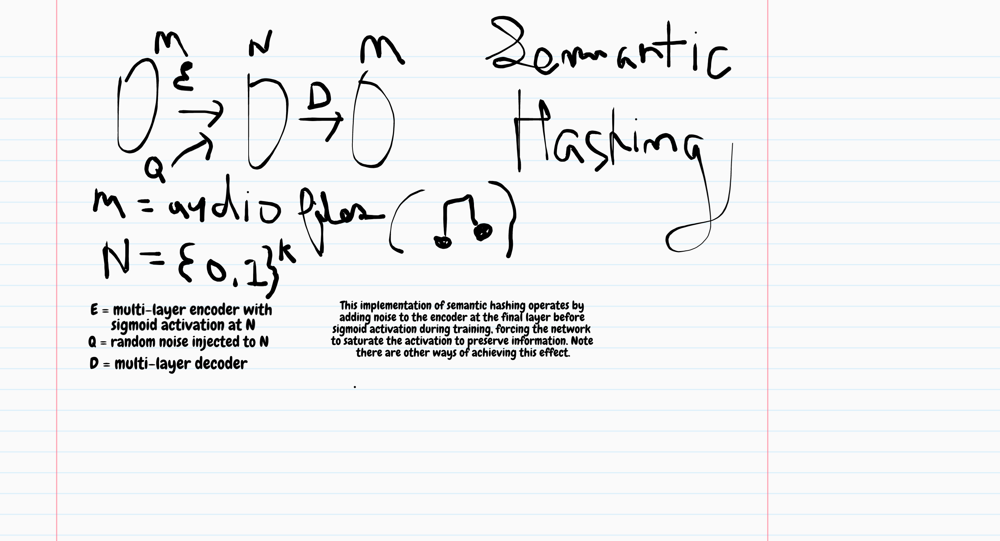

audio semantic hashing
---

## Background

Binary encoding/compression of audio files by way of semantic hashing. In this case short audio snippets of various musical instruments are trained on. Audio files are chunked and passed through a multi-layer encoder and decoder. Noise is added incrementally during training at the encoder just before sigmoid activation, forcing the network to saturate the encoding to preserve information for decoding.

## Dependencies
* Tensorflow
* Python3

## Run

`$ python3 semantic_hashing.py`
